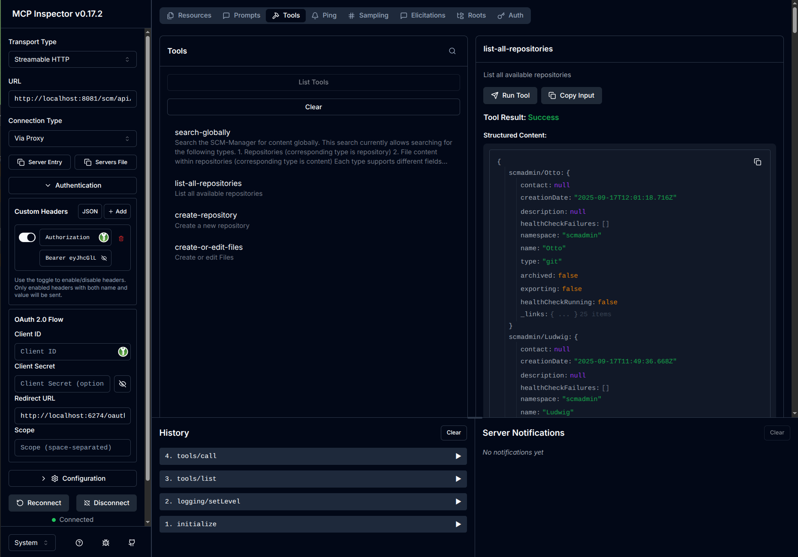
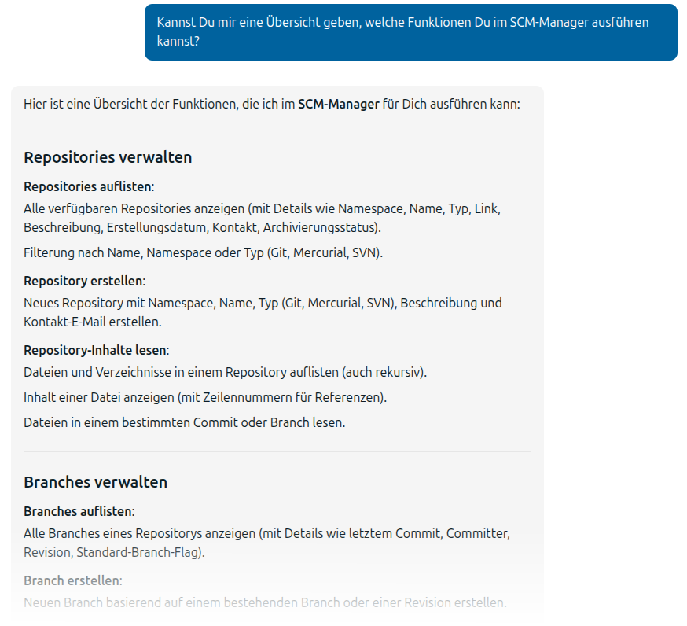

Diese Dokumentation beschreibt die Verwendung des scm-mcp-plugin. 
Sie ist in verschiedenen Sprachen und Versionen verfügbar, die im Menü auf der rechten Seite ausgewählt werden können.

Das MCP-Plugin fügt einen MCP-Endpunkt hinzu, sodass der SCM-Manager von KI-Systemen als MCP-Server verwendet werden kann.

Für die Verbindung muss ein Bearer Token bereitgestellt werden. Dieser kann am einfachsten in From eines API-Schlüssels
für ein entsprechendes Nutzerkonto erstellt werden.

Es stehen verschiedene Tools zur Verfügung, wie zum Beispiel

- Auflisten und Erstellen von Repositories,
- Auflisten und Erstellen von Branches,
- Auflisten, Lesen, Erstellen, Ändern, Umbenennen und Löschen von Dateien in Repositories,
- Auflisten und Lesen von Commits, oder
- die globale SCM-Manager Suche.

Wenn weitere Plugins installiert sind, können diese zusätzliche Tools hinzufügen, wie z. B. das Lesen und Erstellen
von Pull Requests im Review Plugin.

Wenn Sie sich einen Überblick über die Funktionen verschaffen möchten, verbinden Sie sich am besten mit dem
[MCP Inspector](https://github.com/modelcontextprotocol/inspector?tab=readme-ov-file#mcp-inspector). 
Führen Sie dazu `npx @modelcontextprotocol/inspector@latest` aus. 
Wenn dies funktioniert, sehen Sie eine neue Seite in Ihrem Webbrowser, die ungefähr so aussehen sollte:

Um sich mit Ihrem SCM-Manager zu verbinden, müssen Sie:

- Den "Transport Type" im MCP Inspector auf "Streamable HTTP" setzen.
- Die URL auf Ihre SCM-Manager-URL setzen und /api/mcp hinzufügen (zum Beispiel "https://your.scm-manager.org/scm/api/mcp").
- Einen API-Schlüssel im SCM-Manager für den Benutzer erstellen, den Sie für die Anbindung verwenden möchten.
- Die "Authentication"-Einstellungen öffnen und Ihren API-Schlüssel als benutzerdefinierten Header namens
   "Authorization" eingeben. Verwenden Sie das Präfix `Bearer` für den Token (Ihr Token `eyJhcGl...` wird also zu `Bearer eyJhcGl...`).
- Ggf. muss unter "Configuration" noch der "Proxy Session Token" angepasst werden, wenn dieser nicht mit dem nach dem
   Start des MCP Inspector im Log unter "Session Token" ausgegebenen Token entspricht.
- Auf die Schaltfläche "Connect" klicken.
- Wenn die Verbindung erfolgreich war, finden Sie die Tools, indem Sie oben auf der Seite "Tools" auswählen und auf
   "List Tools" klicken.

Wenn die Verbindung an eine KI erfolgreich war, kann aber auch diese meist eine Übersicht darüber geben, was möglich ist:

