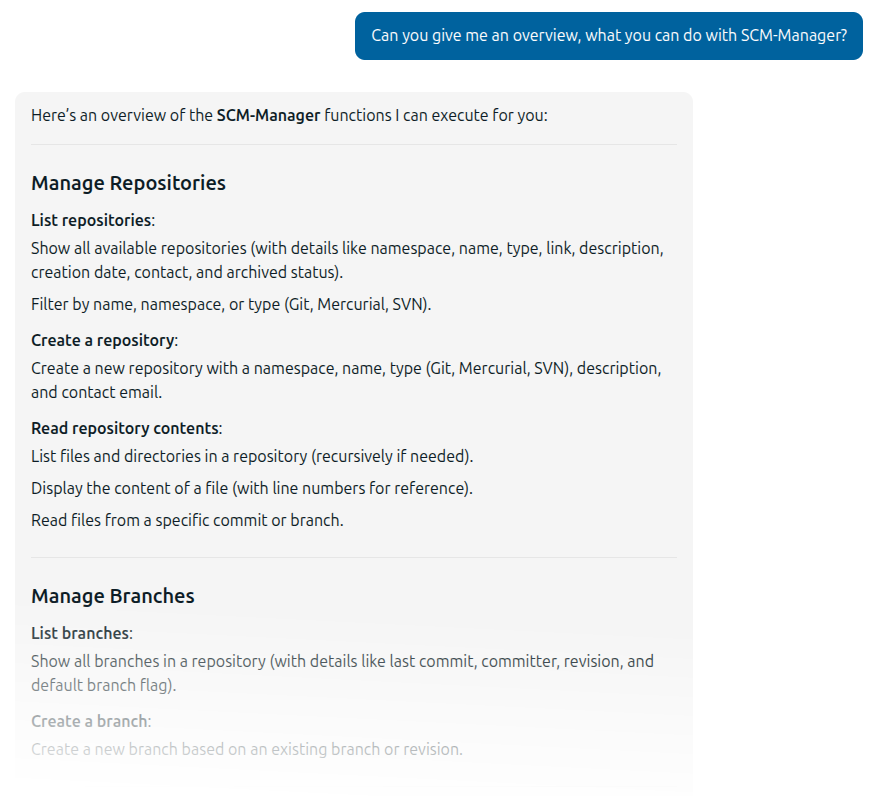

This documentation describes the usage of the scm-mcp-plugin. 
It is available in different languages and versions, which can be selected in the menu on the right.

The MCP plugin adds an MCP endpoint so that SCM-Manager can be used as an MCP server by AI systems.
You have to provide a bearer token to connect.

A bearer token is needed for the connection. This can be created most easily as an API key for a user account.

There are different tools available, like

- listing and creating repositories,
- listing and creating branches,
- listing, reading, creating, modifying, moving, and deletion of files in repositories,
- listing and reading commits, or
- the global search.

Other plugins may add additional tools, like the review plugin that adds tools to read and create pull requests.

If you like to get an overview about the capabilities, it's best to connect using the
[MCP Inspector](https://github.com/modelcontextprotocol/inspector?tab=readme-ov-file#mcp-inspector). 
To do this, run `npx @modelcontextprotocol/inspector@latest`. 
If it works, you will see a new page in your web browser that should look something like this:

To connect to your SCM-Manager, you have to

- Set "Transport Type" in the MCP Inspector to "Streamable HTTP".
- Set the URL to your SCM-Manager URL and add `/api/mcp` (for example "https://your.scm-manager.org/scm/api/mcp").
- Create an API key in SCM-Manager for the user you want to use for connection.
- Open the "Authentication" settings and enter your API key as a custom header named "Authorization". Use the prefix
   `Bearer` for the token (so your token `eyJhcGl...` will become `Bearer eyJhcGl...`).
- Maybe the "Proxy Session Token" in the "Configuration" settings has to be set to the value shown in the log directly
   after the start of the MCP inspector as "Session token".
- Click the "Connect" button.
- If the connection is successful, you will find the tools by selecting "Tools" on the top of the page and clicking "List Tools".

If you have a working connection to an AI, you can also ask this one about the capabilities:

